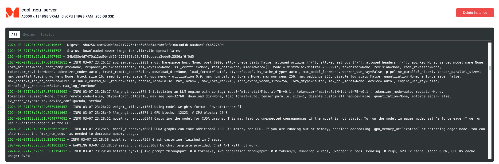

Model Deployment is a very common GPU use case. With Shadeform, it's easy to deploy models right to the most affordable gpu's in the market with just a few commands. 

In this guide, we will deploy [Mistral-7b-v0.1](https://huggingface.co/mistralai/Mistral-7B-v0.1) with VLLM onto an A6000.

### Setup

This guide builds off of our others for [finding the best gpu](https://docs.shadeform.ai/findingmostaffordablegpus) and for [deploying gpu containers](https://docs.shadeform.ai/deployinggpucontainers).
We have a python notebook already to go for you to deploy this model that you can [find here](https://github.com/shadeform/examples/blob/main/basic_serving_vllm.ipynb).
The requirements are simple, so in a python environment with (`requests` + optionally `openai`) installed:

```bash
git clone https://github.com/shadeform/examples.git
cd examples/
```
Then in `basic_serving_vllm.ipynb` you will need to input your [Shadeform API Key](https://platform.shadeform.ai/settings/api). 

### Serving a Model

Once we have an instance, we deploy a model serving container with this request payload.

```python
model_id = "mistralai/Mistral-7B-v0.1"

payload = {
  "cloud": best_instance["cloud"],
  "region": region,
  "shade_instance_type": shade_instance_type,
  "shade_cloud": True,
  "name": "cool_gpu_server",
  "launch_configuration": {
    "type": "docker",
     #This selects the image to launch, and sets environment variables "tasks" and "num_fewshot"
    "docker_configuration": {
      "image": "vllm/vllm-openai:latest",
      "args": "--model " + model_id,
      "envs": [],
      "port_mappings": [
        {
          "container_port": 8000,
          "host_port": 8000
        }
      ]
    }
  }
}

#request the best instance that is available
response = requests.request("POST", create_url, json=payload, headers=headers)
#easy way to visually see if this request worked
print(response.text)
```

Once we request it, Shadeform will provision the machine, and deploy a docker container based on the image, arguments, and environment variables that we selected. 

We can see that this will deploy an openai compatible server with VLLM serving Mistral-7b-v0.1.

### Checking on our Model server

There are three main steps that we need to wait for: VM Provisioning, image building, and spinning up VLLM.

```python
instance_response = requests.request("GET", base_url, headers=headers)
ip_addr = ""
print(instance_response.text)
instance = json.loads(instance_response.text)["instances"][0]
instance_status = instance['status']
if instance_status == 'active':
    print(f"Instance is active with IP: {instance['ip']}")
    ip_addr = instance['ip']
else:
    print(f"Instance isn't yet active: {instance}" )
```

This cell will print the IP address once it has provisioned. However, the image needs to download, and VLLM needs to download the model and spin up, which should take a few minutes.
#### Watch via the notebook
Once the model is ready, this code will output the model list and a response to our query. We can use either requests or OpenAI's completions library.

<CodeGroup>
```python requests
#Wait until the previous cell has an IP address associated with it, and then add a few minutes for the VLLM server to stand up. 
#It is usually best to look at the logs on the dashboard to tell when the model is loaded.

model_list_response = requests.get(f'http://{ip_addr}:8000/v1/models')
print(model_list_response.text)

vllm_headers = {
    'Content-Type': 'application/json',
}

json_data = {
    'model': model_id,
    'prompt': 'San Francisco is a',
    'max_tokens': 7,
    'temperature': 0,
}

completion_response = requests.post(f'http://{ip_addr}:8000/v1/completions', headers=vllm_headers, json=json_data)

print(completion_response.text)
```

```python openai
#Alternatively, you can call this with the Open AI library, but requires that to be downloaded
from openai import OpenAI

# Modify OpenAI's API key and API base to use vLLM's API server.
openai_api_key = "EMPTY"
openai_api_base = f"http://{ip_addr}:8000/v1"
client = OpenAI(
    api_key=openai_api_key,
    base_url=openai_api_base,
)
completion = client.completions.create(model=model_id,
                                      prompt="San Francisco is a")
print("Completion result:", completion)
```
</CodeGroup>
#### Watching with the Shadeform UI
Or once we've made the request, we can watch the logs under [Running Instances](https://platform.shadeform.ai/instances). Once it is ready to serve it should look something like this:



Happy Serving!
